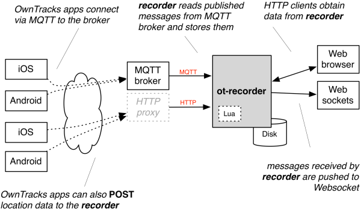
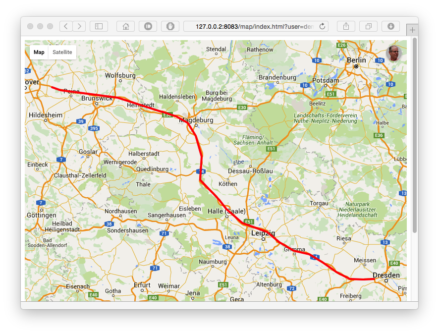
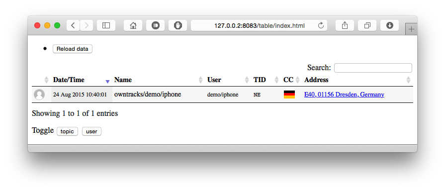
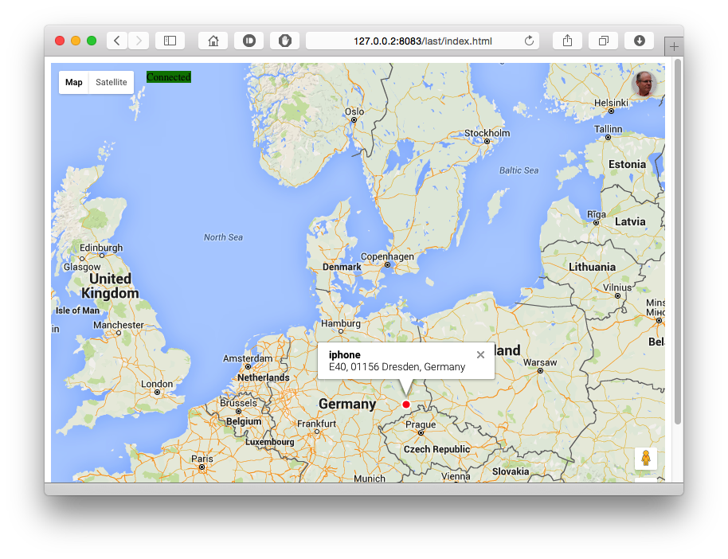

# OwnTracks Recorder

The _OwnTracks Recorder_ is a lightweight program for storing and accessing location data published via MQTT by the [OwnTracks](http://owntracks.org) apps. It is a compiled program which is easily installed and operated even on low-end hardware, and it doesn't require external an external database. It is also suited for you to record and store the data you publish via our [Hosted mode](http://owntracks.org/booklet/features/hosted/).



There are two main components: the _recorder_ obtains, stores, and serves data, and the _ocat_ command-line utility reads stored data in a variety of formats.

## `recorder`

The _recorder_ serves two purposes:

1. It subscribes to an MQTT broker and awaits messages published from the OwnTracks apps, storing these in a particular fashion into what we call the _store_ which is basically a bunch of files on the file system.
2. It provides a Web server which serves static pages with a few examples of how to access the data through its HTTP interface (REST API). In particular a _table_ of last locations has been made available as well as a _live map_ which updates via the _recorder_'s Websocket interface when location publishes are received. In addition we provide maps with last points or tracks using the GeoJSON produced by the _recorder_.

Some examples of what the _recorder_'s built-in HTTP server is capable of:

#### Last position of a particular user

Retrieve the last position of a particular user. Note that we get the same data as reported by _ocat_.

```
$ curl http://127.0.0.2:8083/api/0/last -d user=demo -d device=iphone
[
 {
  "tst": 1440405601,
  "acc": 10,
  "_type": "location",
  "alt": 262,
  "lon": 13.60279820860699,
  "vac": 6,
  "vel": 18,
  "lat": 51.06263391678321,
  "cog": 82,
  "tid": "NE",
  "batt": 99,
  "username": "demo",
  "device": "iphone",
  "topic": "owntracks/demo/iphone",
  "ghash": "u31dmx9",
  "cc": "DE",
  "addr": "E40, 01156 Dresden, Germany"
 }
]
```

#### Display map with points starting at a particular date

By specifying a `format` we can produce GeoJSON, say. Normally, the API retrieves the last 6 hours of data but we can extend or limit this with the `from` and `to` parameters.

```
http://127.0.0.2:8083/map/index.html?user=demo&device=iphone&format=geojson&from=2014-01-01
```

In a suitable Web browser, the result is


#### Display a track (a.k.a linestring)

If we change the `format` parameter of the previous URL to `linestring`, the result is



#### Tabular display

The _recorder_'s Web server also provides a tabular display which shows the last position of devices, their address, country, etc. Some of the columns are sortable, you can search for users/devices and click on the address to have a map opened at the device's last location.



#### Live map

The _recorder_'s built-in Websocket server updates a map as it receives publishes from the OwnTracks devices. Here's an example:




## `ocat`

_ocat_ is a CLI query program for data stored by _recorder_: it prints data from storage in a variety of output formats:

* JSON
* GeoJSON (points)
* GeoJSON (line string)
* CSV
* GPX

The _ocat_ utility accesses _storage_ directly — it doesn’t use the _recorder_’s REST interface. _ocat_ has a daunting number of options, some combinations of which make no sense at all.

Some example uses we consider useful:

* `ocat --list`
   show which uers are in _storage_.
* `ocat --list --user jjolie`
   show devices for the specified user
* `ocat --user jjolie --device ipad`
   print JSON data for the user's device produced during the last 6 hours.
* `ocat --last`
    print the LAST position of all users, devices. Can be combined with `--user` and `--device`.
* `ocat ... --format csv`
   produces CSV. Limit the fields you want extracted with `--fields lat,lon,cc` for example.
* `ocat ... --format xml`
   produces XML. Limit the fields you want extracted with `--fields lat,lon,cc` for example.
```
<?xml version='1.0' encoding='UTF-8'?>
        <?xml-stylesheet type='text/xsl' href='owntracks.xsl'?>
<owntracks>
 <point>
  <tst>1440395361</tst>
  <acc>3000.000000</acc>
  <alt>51</alt>
  <lon>10.027857</lon>
  <vac>29.000000</vac>
  <vel>-1</vel>
  <lat>52.378886</lat>
  <cog>-1</cog>
  <tid>NE</tid>
  <batt>96</batt>
  <ghash>u1r1upq</ghash>
  <cc>DE</cc>
  <addr>Heidecker Weg 86, 31275 Lehrte, Germany</addr>
  <isorcv>2015-08-24T05:55:07Z</isorcv>
  <isotst>2015-08-24T05:49:21Z</isotst>
 </point>
 ...
</owntracks>
```
* `ocat ... --limit 10`
   prints data  for the current month, starting now and going backwards; only 10 locations will be printed. Generally, the `--limit` option reads the storage back to front which makes no sense in some combinations.

Specifying `--fields lat,tid,lon` will request just those JSON elements from _storage_. (Note that doing so with output GPX or GEOJSON could render those formats useless if, say, `lat	 is missing in the list of fields.)

The `--from` and `--to` options allow you to specify a UTC date and/or timestamp from which respectively until which data will be read. By default, the last 6 hours of data are produced. If `--from` is not specified, it therefore defaults to _now minus 6 hours_. If `--to` is not specified it defaults to _now_. Dates and times must be specified as strings, and the following formats are recognized:

```
%Y-%m-%dT%H:%M:%S
%Y-%m-%dT%H:%M
%Y-%m-%dT%H
%Y-%m-%d
%Y-%m
```

The `--limit` option restricts the output to the last specified number of records. This is a bit of an "expensive" operation because we search the `.rec` files backwards (i.e. from end to beginning).

## `ocat` examples

The _recorder_ has been running for a while, and the OwnTracks apps have published data. Let us have a look at some of this data.

#### List users and devices

We obtain a list of users from the _store_:

```
$ ocat --list
{
 "results": [
  "demo"
 ]
}
```

From which devices has user _demo_ published data?

```
$ ocat --list --user demo
{
 "results": [
  "iphone"
 ]
}
```

#### Show the last position reported by a user

Where was _demo_'s _iphone_ last seen?

```
$ ocat --last --user demo --device iphone
[
 {
  "tst": 1440405601,
  "acc": 10,
  "_type": "location",
  "alt": 262,
  "lon": 13.60279820860699,
  "vac": 6,
  "vel": 18,
  "lat": 51.06263391678321,
  "cog": 82,
  "tid": "NE",
  "batt": 99,
  "username": "demo",
  "device": "iphone",
  "topic": "owntracks/demo/iphone",
  "ghash": "u31dmx9",
  "cc": "DE",
  "addr": "E40, 01156 Dresden, Germany"
 }
]
```

Several things worth mentioning:

* The returned data structure is an array of JSON objects; had we omitted specifying a particular device or even a particular user we would have obtained the last position of all this user's devices or all users' devices respectively.
* If you are familiar with the [JSON data reported by the OwnTracks apps](http://owntracks.org/booklet/tech/json/) you'll notice that this JSON contains more information: this is provided on the fly by _ocat_ and the REST API, e.g. from the reverse-geo cache the _recorder_ maintains.

#### What were the last 4 positions reported?

We can limit the number of returned elements: Let's do this as CSV, and limit the fields we are given:

```
$ ocat --user demo --device iphone --limit 4 --format csv --fields isotst,vel,addr
isotst,vel,addr
2015-08-24T08:40:01Z,18,E40, 01156 Dresden, Germany
2015-08-24T08:35:01Z,40,E40, 01723 Wilsdruff, Germany
2015-08-24T08:30:00Z,50,A14, 01683 Nossen, Germany
2015-08-24T08:24:59Z,40,A14, 04741 Roßwein, Germany
```

## Getting started

You will require:

* [libmosquitto](http://mosquitto.org)
* [libCurl](http://curl.haxx.se/libcurl/)
* [lmdb](http://symas.com/mdb) included
* Optionally [Lua](http://lua.org)

Obtain and download the software, either [as a package, if available](https://packagecloud.io/owntracks/ot-recorder), via [our Homebrew Tap](https://github.com/owntracks/homebrew-recorder) on Mac OS X, directly as a clone of the repository, or as a [tar ball](https://github.com/owntracks/recorder/releases) which you unpack. Copy the included `config.mk.in` file to `config.mk` and edit that. You specify the features or tweaks you need. (The file is commented.) Pay particular attention to the installation directory and the value of the _store_ (`STORAGEDEFAULT`): that is where the recorder will store its files. `DOCROOT` is the root of the directory from which the _recorder_'s HTTP server will serve files.

Type `make` and watch the fun. When that finishes, you should have at least two executable programs called `ot-recorder` which is the _recorder_ proper, and `ocat`. If you want you can install these using `make install`, but this is not necessary: the programs will run from whichever directory you like.

### Launching `ot-recorder`

The _recorder_ has, like _ocat_, a daunting number of options, most of which you will not require. Running either utility with the `-h` or `--help` switch will summarize their meanings. You can, for example launch with a specific storage directory, disable the HTTP server, change its port, etc.

If you require authentication or TLS to connect to your MQTT broker, pay attention to the `$OTR_` environment variables listed in the help. 

Launch the recorder:

```
$ ./ot-recorder 'owntracks/#'
```

Publish a location from your OwnTracks app and you should see the _recorder_ receive that on the console. If you haven't disabled Geo-lookups, you'll also see the address from which the publish originated.

The location message received by the _recorder_ will be written to storage. 

### Launching `ot-recorder` for _Hosted mode_

You have an account with our Hosted platform and you want to store the data published by your device and the devices you track. Proceed as follows:

1. Download the [StartCom ca-bundle.pem](https://www.startssl.com/certs/ca-bundle.pem) file to a directory of choice, and make a note of the path to that file.
2. Create a small shell script modelled after the one hereafter (you can copy it from [etc/hosted.sh](etc/hosted.sh)) with which to launch the _recorder_.
3. Launch that shell script to have the _recorder_ connect to _Hosted_ and subscribe to messages your OwnTracks apps publish via _Hosted_.

```bash
#!/bin/sh

export OTR_USER="username"          # your OwnTracks Hosted username
export OTR_DEVICE="device"          # one of your OwnTracks Hosted device names
export OTR_TOKEN="xab0x993z8tdw"    # the Token corresponding to above pair
export OTR_CAFILE="/path/to/startcom-ca-bundle.pem"


ot-recorder --hosted "owntracks/#"
```

Note in particular the `--hosted` option: you specify neither a host name or a port number; the _recorder_ has those built-in, and it uses a specific _clientID_ for the MQTT connection. Other than that, there is no difference between the _recorder_ connecting to Hosted or to your private MQTT broker.


When the recorder has received a publish or two, visit it with your favorite Web browser by pointing your browser at `http://127.0.0.1:8083`.

## Design decisions

We took a number of decisions for the design of the recorder and its utilities:

* Flat files. The filesystem is the database. Period. That's were everything is stored. It makes incremental backups, purging old data, manipulation via the Unix toolset easy. (Admittedly, for fast lookups we employ LMDB as a cache, but the final word is in the filesystem.) We considered all manner of databases and decided to keep this as simple and lightweight as possible.
* We wanted to store received data in the format it's published in. As this format is JSON, we store this raw payload in the `.rec` files. If we add an attribute to the JSON published by our apps, you have it right there. There's one slight exception: the monthly logs (the `.rec` files) have a leading timestamp and a relative topic; see below.
* File names are lower case. A user called `JaNe` with a device named `myPHONe` will be found in a file named `jane/myphone`.
* All times are UTC (a.k.a. Zulu or GMT). We got sick and tired of converting stuff back and forth. It is up to the consumer of the data to convert to localtime if need be.
* The _recorder_ does not provide authentication or authorization. Nothing at all. Zilch. Nada. Think about this before making it available on a publicly-accessible IP address. Or rather: don't think about it; just don't do it. You can of course place a HTTP proxy in front of the `recorder` to control access to it.
* `ocat`, the _cat_ program for the _recorder_ uses the same back-end which is used by the API though it accesses it directly (i.e. without resorting to HTTP).

## Storage

As mentioned earlier, data is stored in files, and these files are relative to `STORAGEDIR` (compiled into the programs or specified as an option). In particular, the following directory structure can exist, whereby directories are created as needed by the _recorder_:

* `cards/`, optional, contains user cards which are published when either you or one of your trackers on Hosted adds a new device. This card is then stored here and used with, e.g., `ocat --last` to show a user's name and optional avatar.
* `ghash/`, unless disabled, reverse Geo data is collected into an LMDB database located in this directory.
* `last/` contains the last location publish from a device. E.g. Jane's last publish from her iPhone would be in `last/jjolie/iphone/jjolie-iphone.json`.
* `monitor` a file which contains a timestamp and the last received topic (see Monitoring below).
* `msg/` contains messages received by the Messaging system.
* `photos/` optional; contains the binary photos from a _card_.
* `rec/` the recorder data proper. One subdirectory per user, one subdirectory therein per device. Data files are named `YYYY-MM.rec` (e.g. `2015-08.rec` for the data accumulated during the month of August 2015.

You should definitely **not** modify or touch these files: they remain under the control of the _recorder_. You can of course, remove old `.rec` files if they consume too much space.


## Reverse Geo

If not disabled with option `-G`, the _recorder_ will attempt to perform a reverse-geo lookup on the location coordinates it obtains and store them in an LMDB database. If a lookup is not possible, for example because you're over quota, the service isn't available, etc., _recorder_ keeps tracks of the coordinates which could *not* be resolved in a file named `missing`:

```
$ cat store/ghash/missing
u0tfsr3 48.292223 8.274535
u0m97hc 46.652733 7.868803
...
```

This can be used to subsequently obtain missed lookups.


## Monitoring

In order to monitor the _recorder_, whenever an MQTT message is received, a `monitor` file located relative to STORAGEDEFAULT is maintained. It contains a single line of text: the epoch timestamp and the last received topic separated from each other by a space. 

```
1439738692 owntracks/jjolie/ipad
```


If _recorder_ is built with `HAVE_PING` (default), a location publish to `owntracks/ping/ping` (i.e. username is `ping` and device is `ping`) can be  used to round-trip-test the recorder. For this particular username/device combination, _recorder_ will store LAST position, but it will not keep a `.REC` file for it. This can be used to verify, say, via your favorite monitoring system, that the _recorder_ is still operational.

After sending a _pingping_, you can query the REST interface to determine the difference in time. The `contrib/` directory has an example Python program (`ot-ping.py`) which you can adapt as needed for use by Icinga or Nagios.

```
OK ot-recorder pingping at http://127.0.0.1:8085: 0 seconds difference
```

## HTTP server

The _recorder_ has a built-in HTTP server with which it servers static files from either the compiled-in default `DOCROOT` directory or that specified at run-time with the `--doc-root` option. Furthermore, it serves JSON data from the API end-point at `/api/0/` and it has a built-in Websocket server for the live map.

The API basically serves the same data as _ocat_ is able to produce.

## API

The _recorder_'s API provides most of the functions that are surfaced by _ocat_.
Both GET and POST requests are supported, and if a username and device are
needed, these can be passed in via `X-Limit-User` and `X-Limit-Device` headers alternatively to GET or POST parameters.
(From and To dates may also be specified as `X-Limit-From` and `X-Limit-To`
respectively.)

The API endpoint is at `/api/0` and is followed by the verb.

#### `monitor`

Returns the content of the `monitor` file as plain text.

```
curl 'http://127.0.0.1:8083/api/0/monitor'
1441962082 owntracks/jjolie/phone
```

#### `last`

Returns a list of last users' positions. (Can be limited by _user_ and _device_.)

```
curl http://127.0.0.1:8083/api/0/last [-d user=jjolie [-d device=phone]]
```

#### `list`

List users. If _user_ is specified, lists that user's devices. If both _user_ and _device_ are specified, lists that device's `.rec` files.

#### `locations`

Here comes the actual data. This lists users' locations and requires both _user_ and _device_. Output format is JSON unless a different _format_ is given (`json`, `geojson`, and `linestring` are supported).

In order to limit the number of records returned, use _limit_ which causes a reverse search through the `.rec` files; this can be used to find the last N positions.

Date/time ranges may be specified as _from_ and _to_ with dates/times specified as described for _ocat_ above.

```
curl http://127.0.0.1:8083/api/0/locations -d user=jpm -d device=5s
curl http://127.0.0.1:8083/api/0/locations -d user=jpm -d device=5s -d limit=1
curl http://127.0.0.1:8083/api/0/locations -d user=jpm -d device=5s -d format=geojson
curl http://127.0.0.1:8083/api/0/locations -d user=jpm -d device=5s -d from=2014-08-03
```

#### `q`

Query the geo cache for a particular _lat_ and _lon_.

```
curl 'http://127.0.0.1:8083/api/0/q?lat=48.85833&lon=2.295'
{
 "cc": "FR",
 "addr": "9 Avenue Anatole France, 75007 Paris, France",
 "tst": 1441984405
}
```

The reported timestamp was the time at which this cache entry was made. Note that this interface queries only -- it does not populate the cache.

#### `block`

Requires POST method and _user_. This is currently incomplete; it simply writes a key into LMDB consisting of "blockme user".


#### `kill`

If support for this is compiled in, this API endpoint allows a client to remove data from _storage_. (Warning: *any* client can do this, as there is no authentication/authorization in the _recorder_!)

```
curl 'http://127.0.0.1:8083/api/0/kill?user=ngin&device=ojo'

{
 "path": "s0/rec/ngin/ojo",
 "status": "OK",
 "last": "s0/last/ngin/ojo/ngin-ojo.json",
 "killed": [
  "2015-09.rec",
 ]
}
```
The response contains a list of removed `.rec` files, and file system operations are logged to syslog.

## Lua hook

If _recorder_ is compiled with Lua support, a Lua script you provide is launched at startup. Lua is _a powerful, fast, lightweight, embeddable scripting language_. You can use this to process location publishes in any way you desire: your imagination (and Lua-scripting knowhow) set the limits. Some examples:

* insert publishes into a database of your choice
* switch on the coffee machine when your OwnTracks device reports you're entering home (but see also [mqttwarn](http://jpmens.net/2014/02/17/introducing-mqttwarn-a-pluggable-mqtt-notifier/)
* write a file with data in a format of your choice (see `etc/example.lua`)

Run the _recorder_ with the path to your Lua script specified in its `--lua-script` option (there is no default). If the script cannot be loaded (e.g. because it cannot be read or contains syntax errors), the _recorder_ unloads Lua and continues *without* your script.

Your Lua program is automatically provided with a table which contains the following members:

* `otr.version` is a read-only string with the _recorder_ version (example: `"0.3.2"`)
* `otr.log()` is a function which takes a string which is logged to syslog at the _recorder_'s facility and log level INFO.
* `otr.strftime(fmt, t)` is a function which takes a format string (see `strftime(3)`) and an integer number of seconds and returns a string with the formatted UTC time. If `t` is 0 or negative, the current system time is used.

Your Lua script must provide the following functions:

### `otr_init`

This is invoked at start of _recorder_. If the function returns a non-zero value, _recorder_ unloads Lua and disables its processing; i.e. the `hook()` will *not* be invoked on location publishes.

### `otr_exit`

This is invoked when the _recorder_ stops, which it doesn't really do unless you CTRL-C it.

### `otr_hook`

This function is invoked at every location publish processed by the _recorder_. Your function is passed three arguments:

1. _topic_ is the topic published to (e.g. `owntracks/jane/phone`)
2. _type_ is the type of MQTT message. This is the `_type` in our JSON messages (e.g. `location`) or `"unknown"`.
3. _location_ is a [Lua table](http://www.lua.org/pil/2.5.html) (associative array) with all the elements obtained in the JSON message. In the case of _type_ being `location`, we also add country code (`cc`) and the location's address (`addr`) unless reverse-geo lookups have been disabled in _recorder_.

Assume the following small example Lua script in `example.lua`:

```lua
local file

function otr_init()
	otr.log("example.lua starting; writing to /tmp/lua.out")
	file = io.open("/tmp/lua.out", "a")
	file:write("written by OwnTracks Recorder version " .. otr.version .. "\n")
end

function otr_hook(topic, _type, data)
	local timestr = otr.strftime("It is %T in the year %Y", 0)
	print("L: " .. topic .. " -> " .. _type)
	file:write(timestr .. " " .. topic .. " lat=" .. data['lat'] .. data['addr'] .. "\n")
end
```

When _recorder_ is launched with `--lua-script example.lua` it invokes `otr_init()` which opens a file. Then, for each location received, it calls `otr_hook()` which updates the file.

Assuming an OwnTracks device publishes this payload

```json
{"cog":-1,"batt":-1,"lon":2.29513,"acc":5,"vel":-1,"vac":-1,"lat":48.85833,"t":"u","tst":1441984413,"alt":0,"_type":"location","tid":"JJ"}
```

the file `/tmp/lua.out` would contain

```txt
written by OwnTracks Recorder version 0.3.0
It is 14:10:01 in the year 2015 owntracks/jane/phone lat=48.858339 Avenue Anatole France, 75007 Paris, France
```

#### Environment

The following environment variables control _ocat_'s behaviour:

* `OCAT_FORMAT` can be set to the preferred output format. If unset, JSON is used. The `--format` option overrides this setting.
* `OCAT_USERNAME` can be set to the preferred username. The `--user` option overrides this environment variable.
* `OCAT_DEVICE` can be set to the preferred device name. The `--device` option overrides this environment variable.

### nginx

Running the _recorder_ protected by an _nginx_ or _Apache_ server is possible and is the only recommended method if you want to server data behind _localhost_. This snippet shows how to do it, but you would also add authentication to that.

```
server {
    listen       8080;
    server_name  192.168.1.130;

    location / {
        root   html;
        index  index.html index.htm;
    }

    # Proxy and upgrade Websocket connection
    location /otr/ws {
    	rewrite ^/otr/(.*)	/$1 break;
    	proxy_pass		http://127.0.0.1:8084;
    	proxy_http_version	1.1;
    	proxy_set_header	Upgrade $http_upgrade;
    	proxy_set_header	Connection "upgrade";
    	proxy_set_header	Host $host;
    	proxy_set_header	X-Forwarded-For $proxy_add_x_forwarded_for;
    }

    location /otr/ {
    	proxy_pass		http://127.0.0.1:8084/;
    	proxy_http_version	1.1;
    	proxy_set_header	Host $host;
    	proxy_set_header	X-Forwarded-For $proxy_add_x_forwarded_for;
    }
}
```
